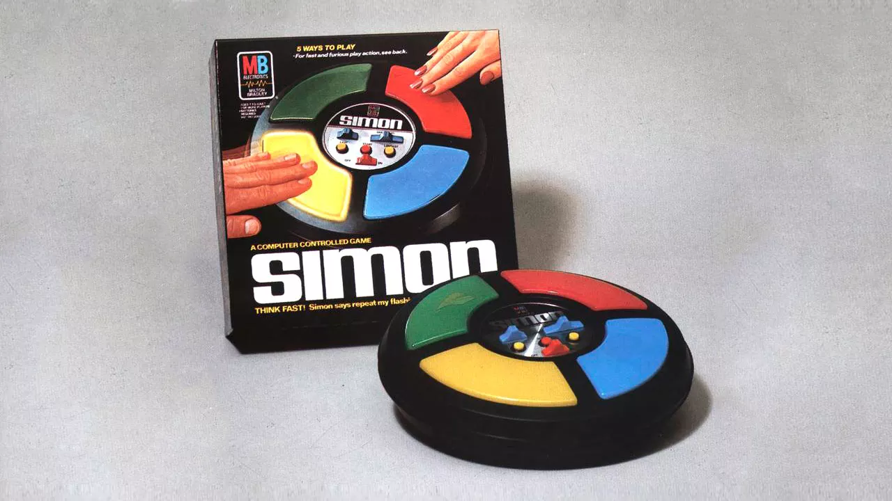
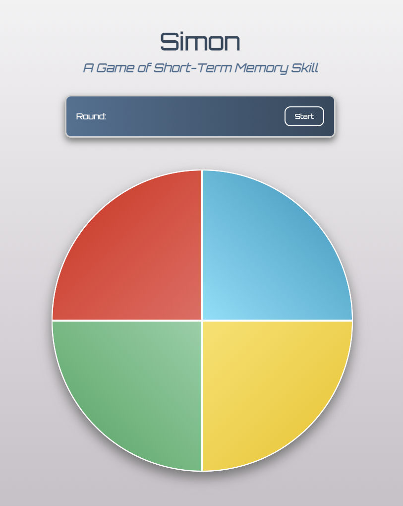

# Simon - A Game of Short-Term Memory Skill

## Overview

### What is Simon? 
Simon is an electronic game of short-term memory skill invented by Ralph H. Baer and Howard J. Morrison, working for toy design firm Marvin Glass and Associates, with software programming by Lenny Cope. The device creates a series of tones and lights and requires a user to repeat the sequence.

<a href="https://americanhistory.si.edu/collections/search/object/nmah_1302005"></a>

### Building Simon
As a part of General Assembly's Software Engineer Immersive program, I was tasked with building a simple game for my Project 1. I chose the game Simon. 


In order to build the game Simon. I created three core functions:

- A function to generate and store a random sequence
```
const sequence = [];
const gameBtns = document.querySelectorAll('.game-button')
function generateSequence() {
   let randomNum = Math.floor(Math.random() * 4)
   sequence.push(gameBtns[randomNum])
   return sequence
}
```
- A function to display the sequence in order
```
let sequenceIdx = 0
function flashButton(callBack) {
   sequence[sequenceIdx].classList.add('active');
   setTimeout(callBack, 1000)
}
function flashNextButton() {
   setTimeout(() => { gameBtns.forEach((button) => (button.classList.remove('active')));}, 500)
   if(sequenceIdx < sequence.length){
      flashButton(flashNextButton)
      sequenceIdx = ++sequenceIdx
   } else {
      playerTurn()
      return sequenceIdx = 0
   }
}
```
- A function to accept user input and check against the current sequence
```
let currentSeq = []
function playerTurn() {
   countDownClock.textContent = 'Your Turn'
   currentSeq = [...sequence]
   gameBtns.forEach((button) => {
      button.classList.add('hoverActive')
      button.addEventListener('click', checkInput)
      button.addEventListener('click', gameButtonAudio)
   })
   return currentSeq
}
function checkInput(event) {
   userInput = event.target.id
   if(userInput === currentSeq[0].id) {
      currentSeq.splice(0,1)
      if (currentSeq.length === 0) {
         gameBtns.forEach((button) => {
            button.classList.remove('hoverActive')
            button.removeEventListener('click', checkInput)
            button.removeEventListener('click', gameButtonAudio)
         })
         countDownClock.textContent = 'Round Complete'
         playSuccessAudio()
         return startGame()
      }
   } else {
      playGameOverAudio()
      countDownClock.textContent = 'Game Over'
      gameBtns.forEach((button) => {
         button.classList.remove('hoverActive')
         button.removeEventListener('click', checkInput)
         button.removeEventListener('click', gameButtonAudio)
      })
      setTimeout(() => {
         window.location.reload() 
      }, 5000)
   }
}
```

## Getting Started - Play Simon

### Link to Simon Game
[Project 1 - Simon Game](https://luigibustos.github.io/project_1/)

<a href="https://luigibustos.github.io/project_1/"></a>

### How to Play
1. Click the 'Start' button in the Simon game console. The three second countdown clock will indicate the start of each round.
2. At the start of round one, Simon will flash the first color, then indicate that it is 'Your Turn.' Repeat the sequence by clicking the same color. Successfully repeating the sequence will end the round and automatically start the next. 
3. For each round, Simon will replay the previous color sequence, then add a new color to the end. 
4. Continue playing as long as you can repeat each sequence correctly. 
5. If you fail to repeat the sequence exactly, Simon will indicate 'Game Over!' through an alert. 

## Technologies Used:


### Additional Resources:

- [ColorSpace](https://mycolor.space/)
- [Coolors](https://coolors.co/)
- [Orbitron Google Font](https://fonts.google.com/specimen/Orbitron)

## Next Steps - Future Features

- [x] Sound Effects for each game buttons
- [ ] Simon will play the sequence faster each round
- [ ] Game Leaderboard
- [ ] Dark Mode

## Connect with me:

<a href="https://www.linkedin.com/in/luigibustos/"></a>
<a href="mailto:LouisAlphonsoBustos@gmail.com"></a>
<a href="https://github.com/luigibustos"></a>